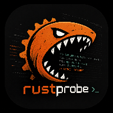

# RustProbe

<p align="center">
  
</p>

RustProbe 是一个面向**非 Root Android 设备**的流量分析探针原型。项目的核心目标是在 Android 官方能力边界内，以 `VPNService` 为入口，把**流量监听、应用归因、结构化分析、可恢复联网能力**尽量放到同一条工程化链路里。

当前它已经不是纸面设计，而是一个能在 Android 真机上拉起、建立 TUN、恢复基础联网、并对 `DNS / TLS SNI / Flow / Object` 做最小分析的可运行原型。

## 项目定位

RustProbe 关注的不是“做一个传统抓包器”，而是：

- 在**无 Root**条件下尽量覆盖设备上的外联流量
- 把流量分析结果尽量**回溯到具体应用**
- 围绕**域名、IP、端口、会话、对象聚合**建立安全观测模型
- 为后续的**恶意外联检测、挖矿检测、取证导出、可视化分析**打基础

一句话概括：

> RustProbe 想做的是一个运行在非 Root Android 上、兼顾可联网与可分析的安全流量探针内核。

## 当前状态

截至 `2026-06-09`，项目已经完成并验证过以下关键能力：

- Android `VPNService` 可正常建立 TUN
- Kotlin -> JNI -> Rust 的 fd 传递链路已打通
- Rust 后台线程可持续读取流量
- 已支持 `IPv4 / IPv6 / TCP / UDP / ICMP / ICMPv6` 基础解析
- 已支持五元组 `flow` 聚合
- 已支持 `IP / Port / Domain` 对象聚合
- 已支持最小可用的 `DNS` 识别与域名提取
- 已支持 `TLS ClientHello / SNI` 最小识别
- 已支持 `QUIC Initial` 片段重组与服务名补全
- 已支持 JSONL 输出到 Android App 私有目录
- 已支持基于 `getConnectionOwnerUid(...)` 的应用归因闭环
- 已支持单应用 / 多应用监听选择
- 已接入 Android 原生 `hev-socks5-server + hev-socks5-tunnel`
- `forwarding mode` 下已可继续联网，并保留最小可观测性

当前仍然明确存在的边界：

- `capture mode` 与 `forwarding mode` 还没有彻底合并成一条统一主链路
- `forwarding mode` 已可恢复联网，但还需要继续优化高流量下的稳定性和覆盖率
- `HTTP` 明文请求信息还未完整接入主分析链路
- UI 仍处于骨架阶段，项目重点仍在底层数据通路
- 测试体系还偏薄，尤其缺少更完整的 Android 集成验证

## 项目预览

当前仓库里可直接复用的项目视觉资源比较有限，README 先引用 Android App 现有图标作为入口标识。后续如果补充真机截图、架构图或 UI 截图，可以继续扩展这里。

## 快速导览

- 架构说明：[docs/architecture.md](docs/architecture.md)
- Android APK 构建说明：[docs/android-apk-build.md](docs/android-apk-build.md)
- 下一阶段计划：[docs/next-step-plan.md](docs/next-step-plan.md)
- Rust 替换路线图：[docs/rust-replacement-roadmap.md](docs/rust-replacement-roadmap.md)
- 威胁检测规划：[docs/threat-detection-plan.md](docs/threat-detection-plan.md)
- Android 宿主说明：[android/README.md](android/README.md)

## 核心能力

### 1. 无 Root 捕获

RustProbe 的首选流量入口是 Android `VPNService` 提供的 TUN 设备。它不依赖：

- Root
- Magisk
- 内核模块
- `iptables` / `nftables`
- `AF_PACKET` 原始抓包

这意味着项目默认接受 Android 用户态能力边界，但也因此更容易部署、测试和产品化。

### 2. 双运行模式

当前项目已经形成两种主要运行模式。

#### `capture mode`

路径如下：

```text
App traffic
  -> Android VPN TUN
  -> Rust capture thread
  -> parse / flow / attribution / object aggregation / JSONL
```

特点：

- 适合验证分析链路
- 适合做协议解析、对象聚合、归因和落盘
- 当前不会负责转发真实流量
- 开启后业务网络会中断

#### `forwarding mode`

路径如下：

```text
App traffic
  -> Android VPN TUN
  -> hev-socks5-tunnel
  -> local hev-socks5-server (127.0.0.1:1080)
  -> protected outbound sockets
  -> Internet
```

特点：

- 适合恢复真实联网能力
- 已在真机上验证可用
- 当前通过 mirror 机制把部分转发链路数据重新送回 Rust 侧做分析
- 同时保留 `forwarding-socks5.log` / `forwarding-tproxy.log` 等最小可观测性

### 3. 应用归因

项目不是只做“看到包”，而是强调“知道是谁发的”。目前已经支持：

- 单应用监听
- 多应用监听
- 基于连接 owner UID 的归因闭环
- 按应用维度聚合连接和对象

### 4. 协议与对象分析

当前主分析链路已经能围绕以下对象工作：

- `Flow`
- `IP`
- `Port`
- `Domain`
- `DNS Query`
- `TLS SNI`
- `QUIC Initial SNI`

这让项目可以逐步向安全检测演进，而不是停留在原始流量收集。

## 总体架构

项目当前建议按三层理解：

```text
+----------------------------------------------------------------------------------+
|                                 RustProbe App                                    |
+----------------------------------------------------------------------------------+
|                            Presentation / UI Layer                               |
|----------------------------------------------------------------------------------|
| Dashboard | 应用监控 | 对象分析 | 连接列表 | 会话详情 | 告警中心 | 设置/导出     |
+-------------------------------------------+--------------------------------------+
                                            |
                                            | WebView / Frontend
                                            v
+----------------------------------------------------------------------------------+
|                          Android Shell / Control Layer                           |
|----------------------------------------------------------------------------------|
| MainActivity | App Selector | Config Manager | Export Manager | Permission Flow  |
| VPNService   | protect()    | TUN fd bridge  | IPC bridge     | Lifecycle Mgmt   |
+-------------------------------------------+--------------------------------------+
                                            |
                                            | JNI / UDS / IPC
                                            v
+----------------------------------------------------------------------------------+
|                             Rust Core / Analysis Layer                           |
|----------------------------------------------------------------------------------|
| Capture  | Parse  | Flow  | Attribution | Object Agg | Metrics | Detect | Store |
+-------------------------------------------+--------------------------------------+
                                            |
                                            | read / process packets
                                            v
+----------------------------------------------------------------------------------+
|                             Android VPN / Network Layer                          |
|----------------------------------------------------------------------------------|
| VPNService TUN | Target Apps | IPv4/IPv6 Traffic | Relay / Forwarding           |
+----------------------------------------------------------------------------------+
```

### Android 容器层

Android 侧负责：

- `VPNService`
- 用户授权与权限流程
- TUN 建立和生命周期管理
- App 选择逻辑
- JNI 桥接
- 本地 forward 组件拉起
- 输出目录与日志目录管理

### Rust 核心层

Rust 侧负责：

- 报文读取
- IP / TCP / UDP / ICMP 解包
- 最小协议识别
- flow 聚合
- 对象聚合
- 应用归因结果消费
- JSONL 输出
- 后续检测与规则引擎扩展

### UI 展示层

UI 目前还不是项目重点，但目标已经明确：

- 展示连接视图
- 展示应用维度流量
- 展示对象维度分析
- 展示告警和行为线索
- 支持导出与回放

## 数据处理链路

当前推荐把项目的数据路径理解成下面这条流水线：

```text
TUN packet
  -> Rust / Forward bridge ingest
  -> packet parse
  -> protocol hint extraction
  -> flow update
  -> object update
  -> app attribution
  -> JSONL / metrics / detection
```

细分后主要包括以下阶段。

### 1. 采集层

- 从 TUN 读取 IP 数据包
- 在 forwarding 模式下从镜像桥接入口补回分析所需数据
- 维护运行时状态与基础计数

### 2. 解包层

当前已覆盖：

- IPv4
- IPv6
- TCP
- UDP
- ICMP
- ICMPv6

### 3. 协议识别层

当前已具备最小能力：

- `DNS`
- `TLS ClientHello`
- `TLS SNI`
- `HTTP Host` 的基础补位逻辑
- `QUIC Initial` 片段重组与 `SNI` 提取

### 4. Flow 层

围绕五元组维护：

- 首包时间
- 末包时间
- 字节计数
- 报文计数
- 协议提示
- 域名来源优先级
- 应用归因结果

### 5. 对象聚合层

当前对象模型已包含：

- `IP`
- `Port`
- `Domain`

对象聚合的价值是把“包和流”转成更适合分析和展示的安全对象视角。

### 6. 存储与输出层

当前以 JSONL 为主，便于：

- Android 私有目录持久化
- 后续 UI 消费
- 离线分析
- 样本回放
- 简单调试

## 目录结构

当前仓库大体可以按下面理解：

```text
rustprobe/
├── android/                  # Android 宿主、VPNService、JNI 集成与打包脚本
├── crates/
│   ├── rustprobe-app/        # Rust CLI / 集成入口
│   ├── rustprobe-attrib/     # 归因相关能力
│   ├── rustprobe-capture/    # 捕获相关能力
│   ├── rustprobe-core/       # 核心模型、配置、事件定义
│   ├── rustprobe-detect/     # 检测能力预留
│   ├── rustprobe-ffi/        # Android JNI 暴露层
│   ├── rustprobe-flow/       # Flow 聚合与对象聚合
│   ├── rustprobe-ipc/        # IPC 能力预留
│   ├── rustprobe-metrics/    # 指标能力预留
│   ├── rustprobe-parse/      # 协议解析与特征提取
│   └── rustprobe-store/      # 存储能力预留
├── docs/                     # 架构说明、构建说明、路线图与规划文档
├── samples/                  # 样例文档或数据
└── ui/                       # 前端骨架
```

## 当前最值得关注的 crate

如果你第一次进入这个仓库，通常建议优先看这几个模块：

- `crates/rustprobe-core`
  - 放核心数据模型、配置和通用类型
- `crates/rustprobe-parse`
  - 放协议识别和最小解析逻辑
- `crates/rustprobe-flow`
  - 放 flow 聚合、对象聚合和域名优先级逻辑
- `crates/rustprobe-ffi`
  - 放 Android 到 Rust 的 JNI 桥接入口
- `android/app/src/main/java/io/rustprobe/app`
  - 放 Android 宿主、`VPNService` 与 forward 组件整合逻辑

## 已实现的工程特性

### Rust 侧

- 工作区已拆分为多 crate，职责边界相对清晰
- 解析与聚合逻辑已经从“单文件实验”迈向“模块化内核”
- 已有最小单元测试覆盖部分 flow / domain 行为

### Android 侧

- Gradle 可自动触发 Rust JNI 编译
- 已集成 Android NDK 构建流程
- 真机上可建立 VPN
- forward 模式可拉起本地 `SOCKS5 server` 与 `tun2socks`

### Forwarding 性能相关

近期已做过一轮偏稳妥的 forwarding 参数调优：

- 提升 `tcp-buffer-size`
- 提升 UDP 接收缓冲
- 提高 UDP copy buffer 数量
- 打开 socks5 handshake `pipeline`
- 按设备 CPU 数动态配置本地 SOCKS5 worker 数

这些改动的目标是：

- 不牺牲监听链路
- 尽量保障 forward 模式下的流畅联网体验

## 构建与运行

### Rust 本地验证

如果你只想验证 Rust 工作区是否可编译或测试，可以在仓库根目录执行：

```bash
cargo build
cargo test
```

### Android APK 构建

Android 打包依赖：

- Android SDK
- Android NDK
- `cargo-ndk`
- Rust Android targets

常用命令在 `android/` 目录下执行：

```bash
./gradlew assembleDebug
./gradlew assembleRelease -Prust.android.profile=release
```

如果你只想验证能否编译，而不安装到设备：

```bash
./gradlew :app:assembleDebug
```

如果你想直接安装到手机或模拟器：

```bash
./gradlew :app:installDebug
```

注意：`installDebug` 需要有可用的 Android 设备或模拟器连接到 `adb`。

更多细节见：[docs/android-apk-build.md](docs/android-apk-build.md)

## 输出与可观测性

当前项目主要输出落在 Android App 私有目录中，常见内容包括：

- `flows.jsonl`
- `objects.jsonl`
- `analytics.jsonl`
- `forwarding-events.jsonl`
- `forwarding-socks5.log`
- `forwarding-tproxy.log`

这些文件用于：

- 调试链路是否打通
- 验证 flow / object 聚合是否正确
- 检查转发模式下的最小可观测性
- 为后续 UI、回放、导出提供输入

## 现实边界

RustProbe 当前默认接受以下现实约束：

- 无法像 Root 方案那样抓到物理网卡原始帧
- 通常拿不到链路层头部与完整链路层上下文
- 通常无法稳定拿到远端 `MAC`
- 少量未经过 `VPNService` 的系统内部通信可能不可见
- 必须非常注意避免把 App 自己的代理流量再次捕获形成回环

因此项目目标不是“完全等价于系统级探针”，而是：

> 在非 Root 条件下，以 `VPNService` 为中心，尽最大可能覆盖应用外联流量，并把分析结果组织成可归因、可导出、可检测的结构化数据。

## 下一阶段重点

当前最重要的工作方向大致有四个：

### 1. 合并转发与分析主链路

这是最关键的一步。理想目标是：

- 用户开启探针后依然可联网
- Rust 侧仍能获得足够完整的分析数据
- 不必在“能分析”和“能联网”之间二选一

### 2. 提升 forwarding 稳定性

重点包括：

- 高流量并发稳定性
- 覆盖率统计
- 延迟与吞吐表现
- 更细的 runtime metrics

### 3. 扩充协议与对象层能力

后续优先级较高的方向：

- 更完整的 `HTTP` 识别
- 更稳定的 `QUIC` 线索提取
- 更丰富的对象关系与时间线

### 4. 建立更像产品的展示层

后续 UI 应至少覆盖：

- Dashboard
- 应用监控
- 对象分析
- 会话详情
- 告警中心
- 导出与取证入口

## 开发建议

如果你准备继续推进这个项目，比较推荐的阅读顺序是：

1. 先读本 README，把项目目标、边界、当前状态建立起来
2. 再看 [docs/architecture.md](docs/architecture.md)，理解整体设计
3. 再看 `android/app/src/main/java/io/rustprobe/app`，理解 Android 宿主与 VPN 生命周期
4. 再看 `crates/rustprobe-ffi`，理解 JNI 到 Rust 的桥接
5. 再看 `crates/rustprobe-parse` 与 `crates/rustprobe-flow`，理解分析核心

## 里程碑视角

可以把项目当前阶段粗略理解成：

- `P0 稳定化与可观测性`
  - 已完成基础版
- `P1 应用归因`
  - 主链路已打通
- `P2 应用层最小解析`
  - `DNS / TLS SNI / QUIC Initial SNI` 已达到最小可用
- `P3 转发链路`
  - Android 原生转发已达到最小可用
- `P4 统一主链路`
  - 仍在推进中

## 适合谁看这个项目

RustProbe 目前最适合以下几类人：

- 想在 Android 非 Root 环境里做流量观测的人
- 想做 `VPNService + Rust` 混合架构的人
- 想做应用级流量归因、安全分析、对象聚合的人
- 想把“转发”和“分析”结合成一条工程链路的人

## 总结

RustProbe 当前最有价值的地方，不是它已经把所有功能都做完了，而是它已经把几个最难的基础问题串起来了：

- Android 无 Root 流量入口
- Kotlin / JNI / Rust 跨层桥接
- 基础协议解析与 flow 聚合
- 应用归因
- 真机 forwarding 可用性

接下来真正决定项目上限的，是能否把这些能力收拢成一条**稳定、可持续、可扩展**的统一主链路。
